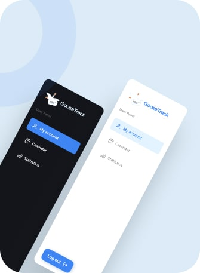
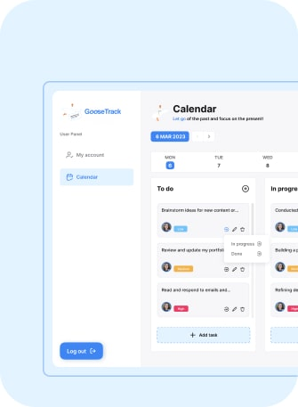

  

<h1 align="center">GooseTracks</h1>

  

<h2 align="center">Вигляд Календаря</h2>

  Календарний вигляд GooseTracks надає зрозумілий огляд вашого розкладу, відображаючи всі ваші завдання, події та зустрічі візуально привабливим та інтуїтивним інтерфейсом. Легко відстежуйте свої щоденні, щотижневі або щомісячні зобов'язання, забезпечуючи відсутність пропущених важливих подій.

  

<h2 align="center">Бічна Панель</h2>

  GooseTrack надає легкий доступ до налаштувань облікового запису, календаря та фільтрів через Бічну Панель. Розділ "Мій Обліковий Запис" дозволяє керувати інформацією вашого профілю та налаштуваннями, забезпечуючи індивідуальний досвід користувача GooseTracks. Календар в Бічній Панелі надає швидкий та зручний спосіб перегляду надходячих подій та завдань на одному екрані.

  

<h2 align="center">Все-в-Одному</h2>

  GooseTracks - це ваш найкращий інструмент для продуктивності, розроблений для спрощення вашого життя. Попрощайтеся з розкиданими списками завдань та вітайте організовану продуктивність з GooseTracks. Відстежуйте завдання, події та терміни в одному місці, що робить його простішим, ніж будь-коли, щоб бути організованим і вчасно виконувати свої зобов'язання.

  

<h2 align="center">Відгуки</h2>

  Ми цінуємо вашу думку! Будь ласка, поділиться вашими думками та враженнями від GooseTracks. Ваші відгуки допомагають нам покращити та надавати кращий сервіс нашим користувачам.

  Дякуємо вам за вибір <strong>GooseTracks</strong>, і сподіваємося, що цей інструмент покращить вашу продуктивність та спростить ваш розклад.

